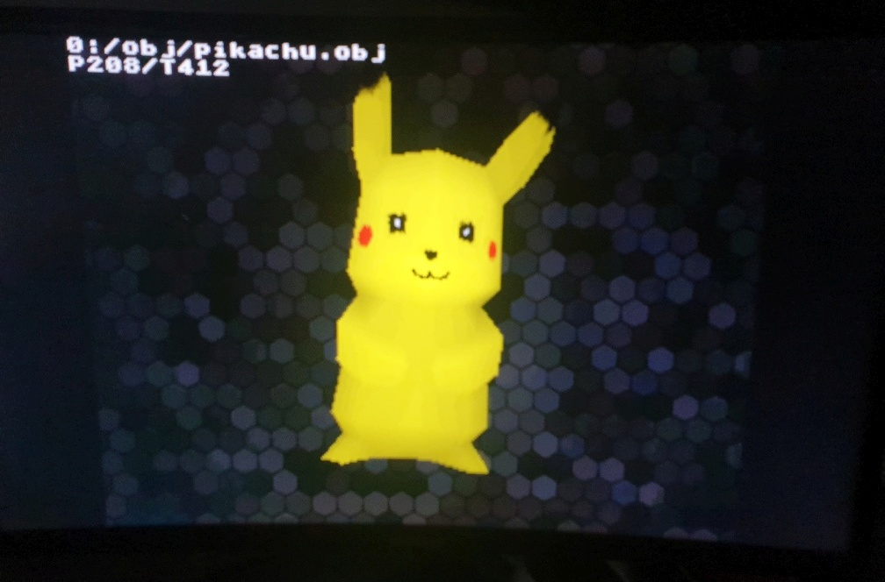
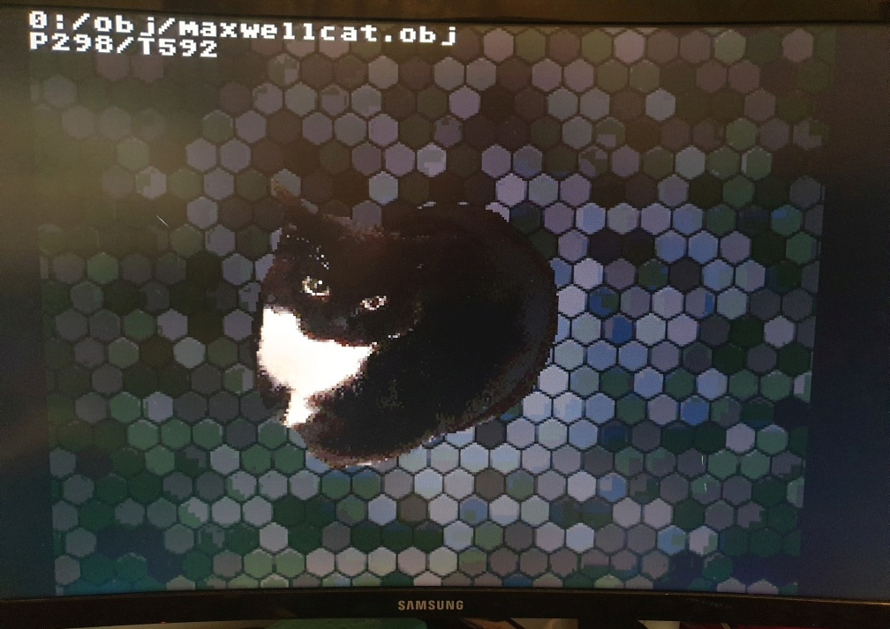

# RiscVSOCQ13
RiscV SOC based on PicoRV core for Cyclone IV GX ( qmtech board + custom base board )

Contains:
- PicoRV RiscV core ( https://github.com/YosysHQ/picorv32 )
- VGA framebuffer ( 565 color gfx modes + text overlay ), analog and DVI video output
- 2D blitter with alpha channel and bitmap scaling
- 3D gouraud hw accelerator with texture and light support
- Memory mapped floating point ALU 
- Serial interface for program upload
- SPI interface - sd card support
- USB HID host controller ( https://github.com/nand2mario/usb_hid_host )
- SDRAM controller

Contact info: qubeck78@wp.pl

Shell

Hardware 3D .obj rendering

Anti aliased fonts

Displaying bitmaps/jpegs from SD

